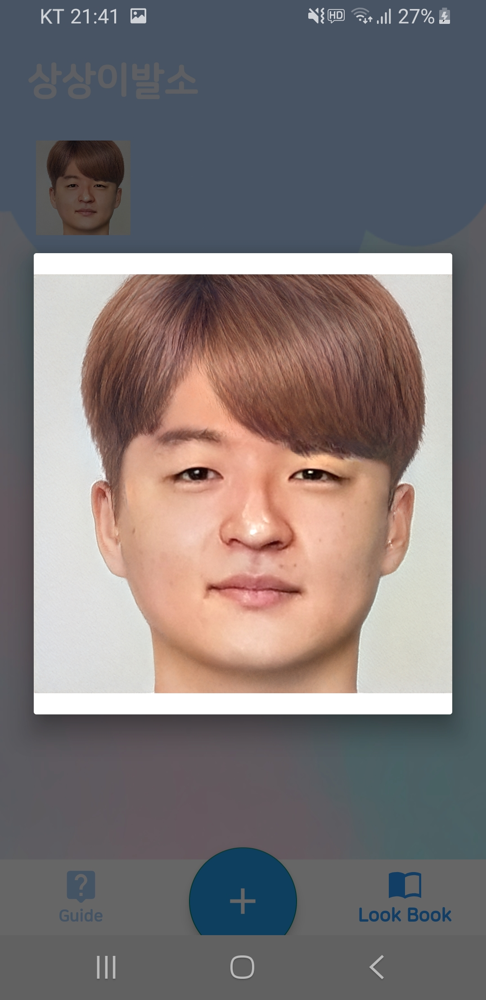

# Imagine-Hair-Shop (상상이발소)
헤어스타일 시뮬레이션 앱

> 경기대학교 컴퓨터공학부 캡스톤디자인  
> 팀명: 나비보벳따우 뽀보벳띠 빠삐벳뽀  
> 프로젝트명: 상상이발소  
> 본 프로젝트는 NIPA의 지원을 받아 제작되었습니다.  

기존 헤어스타일 시뮬레이션 앱들은 사용자가 헤어 스티커를 사진에 붙힘으로써 인위적인 사진이 만들어 졌다면, 본 프로젝트는 GAN(Generative Adversarial Network)과 딥러닝 모델 Face swap을 활용하여 인위적인 모습을 자연스럽게 변환시켜 사진 속 헤어스타일을 마치 자신의 실제 헤어스타일이 된 것처럼 만든다.

## Demo
    

## How?
### AI 모델의 성능 향상을 위해 새로운 데이터셋을 구축
오픈 소스 AI 모델의 성능이 예상보다 좋지 않다는 문제가 있었고, 새로운 학습 데이터셋을 구축하고 학습시켜 해결했다. StarGAN, StyleGAN 등 다양한 오픈 소스를 검토했고, 최종적으로 사진으로부터 스타일을 추출하고 다시 사진으로 만들어내는 기능을 활용하기 위해 StyleGAN2 오픈 소스를 선택했다. 오픈 소스에서 제공하는 모델을 사용하던 중, 우리의 테스트 이미지에 대한 성능이 매우 떨어지는 문제점을 발견했다. 제공된 모델은 오픈 소스에서 제공하는 FFHQ(Flickr-Faces-HQ Dataset) 데이터셋에 편향된 스타일로 추출된다는 문제가 있었고, 프로젝트에 적합한 얼굴 외형과 헤어스타일을 추출하기 위해서는 프로젝트 조건에 부합하는 새로운 데이터셋을 구축해야 한다고 결론을 내렸다.

새로운 데이터셋을 구축하기 위해 인스타그램 크롤링을 통해 대량의 데이터를 수집하였고, 학습 데이터 이미지 조건에 부합하도록 얼굴을 인식하여 잘라내는 작업이 필요했다. 해상도를 조절하거나 얼굴 크기를 맞추는 등 일련의 과정을 모두 통합하여 코드로 자동화시켰으며, 약 12,000장의 이미지 데이터를 확보했다. 최종적으로는 중복된 사진 또는 프로젝트와 관련이 없는 이미지를 직접 분류하여 총 6,000장의 데이터셋을 구축했고, 이 데이터셋을 기반으로 모델을 파인 튜닝(Fine Tunning)함으로써 헤어스타일을 추출하는 성능이 향상되는 결과를 얻었다.
  
### FaceSwap을 통해 이미지 속 이질감 제거
헤어스타일을 추출하는 성능이 향상된 것과 별개로, 인공지능을 통해 얻은 가상 이미지의 얼굴 부위는 여전히 어색한 모습이 남아있었다. StyleGAN2의 가상 이미지 속 얼굴은 변형이 있어서 사용자 본래의 얼굴과 미묘하게 다른 이미지가 도출되기도 하여, 이는 사용자에게 이미지에 대한 거부감을 유발할 수 있다는 문제가 있었다.

이를 해결하기 위해 최초 입력값인 사용자의 얼굴을 결과로 나온 가상 이미지에 이식하여 후처리하는 방식을 고안하였다. 오픈 소스 FaceSwap을 이용하였으며, 다소 부자연스러운 경계선 부분의 얼굴 색상 차이를 가우시안 블러(Gaussian Blur) 처리함으로써 해결했다.
  
### 백그라운드로 실행시켜 사용성 향상
GAN 모델에서 헤어스타일을 추출하는 과정이 많은 시간을 차지하여, 약 3분이라는 매우 긴 시간이 걸렸다. 최초 기획했던 앱은 서버로부터 응답이 올 때까지 기다려야 하는 방식으로 설계했기 때문에, 3분이라는 처리 시간 동안 사용자는 앱 내에서 다른 행위를 할 수 없다는 불편함이 있다.

이 불편함을 해결하기 위해서 이미지 처리 작업을 백그라운드에서 기다릴 수 있도록 비즈니스 로직을 수정하였다. 안드로이드에서 이미지 처리를 요청하고 기다리는 시간에, 백그라운드에서 IntentService가 이미지 처리가 완료되었는지 간헐적으로 요청을 보내도록 했다. 처리가 완료되었다면 저절로 결과 이미지가 앱 내 앨범에 추가되도록 하였다. 백그라운드 서비스를 구현하기 위해 안드로이드 개발자 문서를 참조하였는데, IntentService는 일부 모델에 대해서 제한이 있었다. 이를 해결하기 위해서는 문서에 따라 JobIntentService를 활용하려 했으나, 제한 시간 내에 구현하지 못하였고, 일부 모델을 제외하고 서비스를 제공하였다.

## YouTube
- https://www.youtube.com/watch?v=IcBrkL0-9xU

## References
- https://github.com/NVlabs/stylegan2
- https://github.com/wuhuikai/FaceSwap
