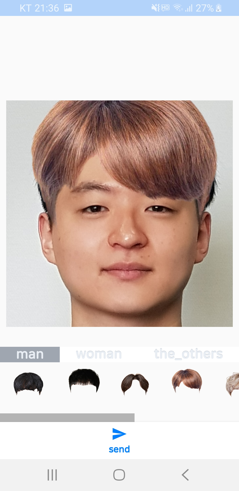

# 상상이발소 (Imagine-Hair-Shop)
헤어스타일 시뮬레이션 앱

> 경기대학교 컴퓨터공학부 캡스톤디자인  
> 팀명: 나비보벳따우 뽀보벳띠 빠삐벳뽀  
> 서비스명: 상상이발소  
> 본 프로젝트는 NIPA의 지원을 받아 제작되었습니다.  

## 차별점
기존 헤어스타일 시뮬레이션 앱들은 사용자가 헤어 스티커를 사진에 붙힘으로써 인위적인 사진이 만들어 졌다면, 본 프로젝트는 GAN(Generative Adversarial Network)과 딥러닝 모델 Face swap을 활용하여 인위적인 모습을 자연스럽게 변환시켜 헤어스타일이 마치 자신의 실제 헤어가 된 것처럼 만든다.

## 실행화면 캡처
    

## YouTube
https://www.youtube.com/watch?v=IcBrkL0-9xU

