# 상상이발소 안드로이드 앱
상상만 했던 헤어스타일을 직접 체험해보세요 !

## Demo
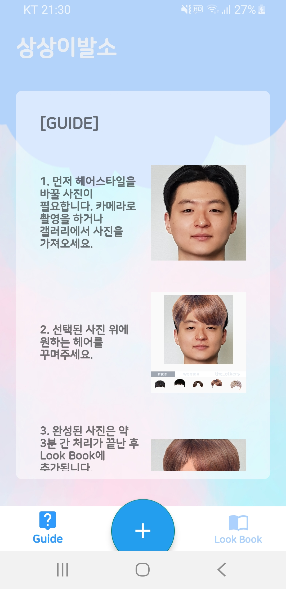 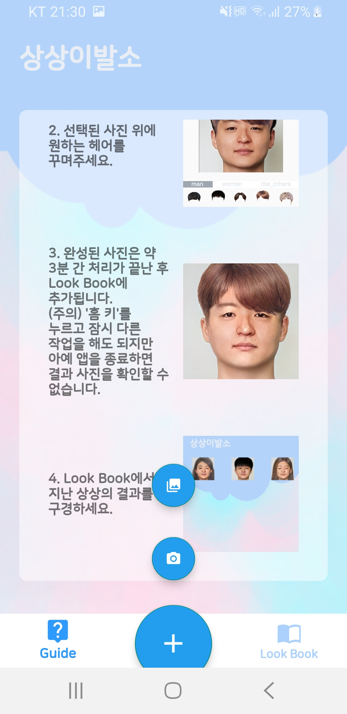  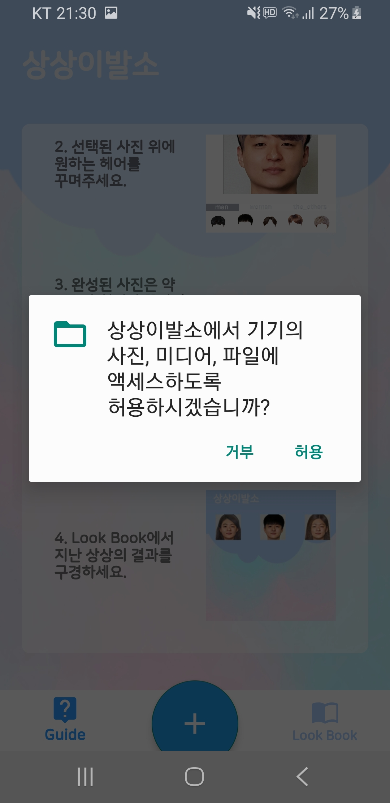 
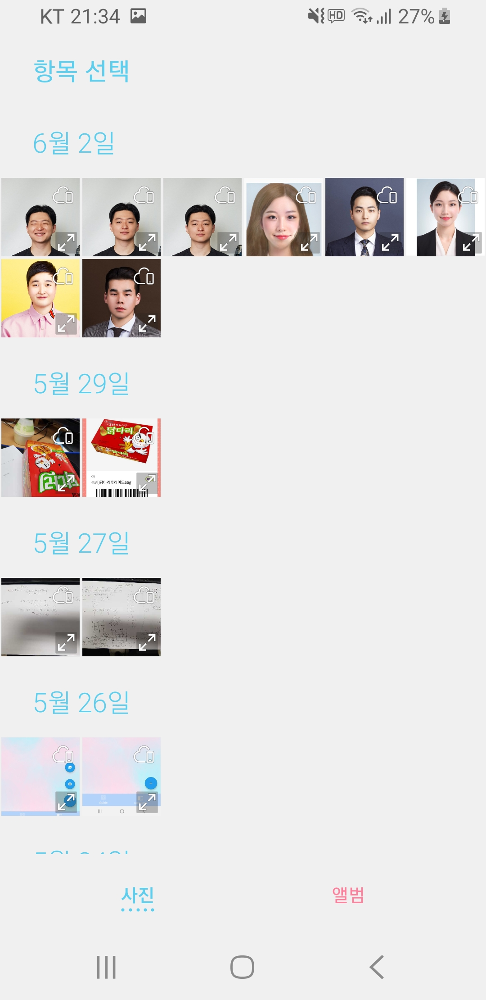  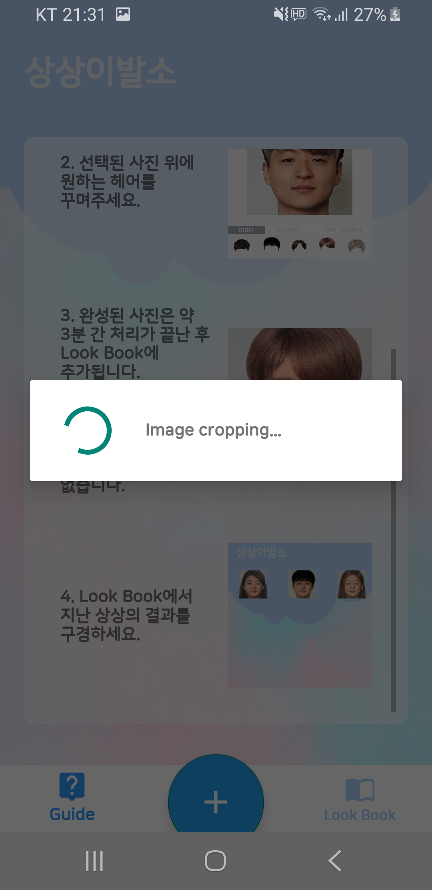  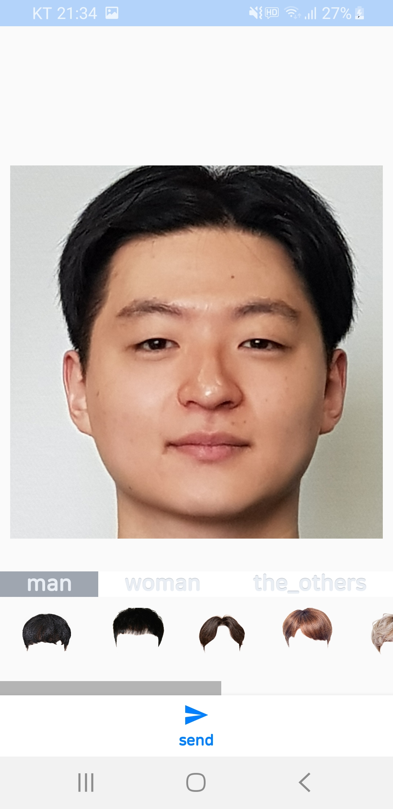 

 

사용자의 갤러리에서 사진을 가져와서, 상상이발소에서 처리 가능하게끔 crop하는 과정을 거친다. 사용자 갤러리가 아닌 바로 카메라로 찍어서 이용 가능하며, 사진이 올바르지 않을 경우 다시 사진을 요구한다.

 

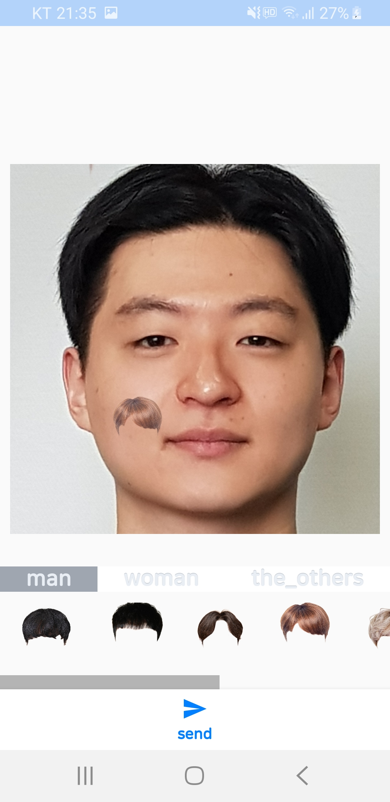  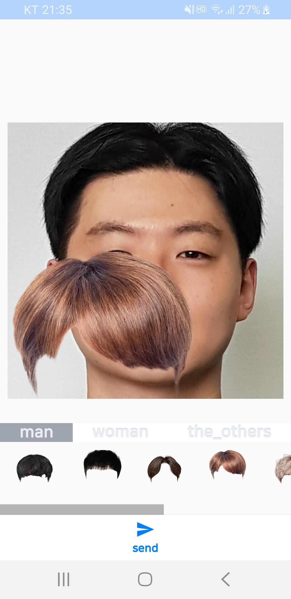  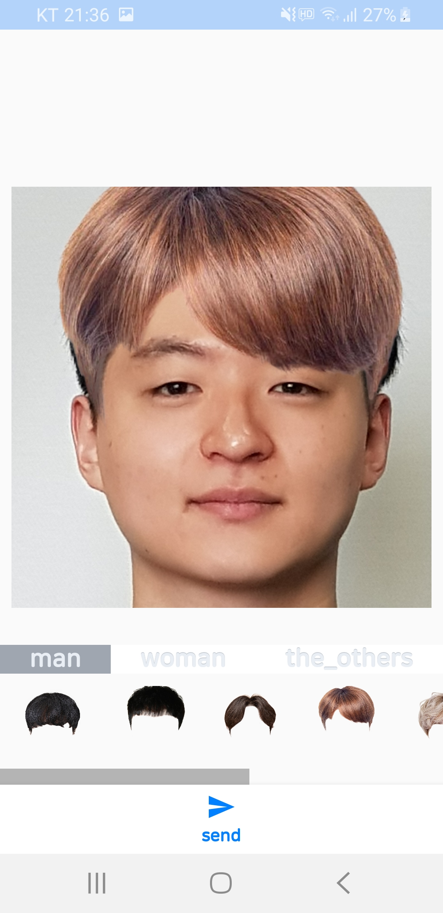  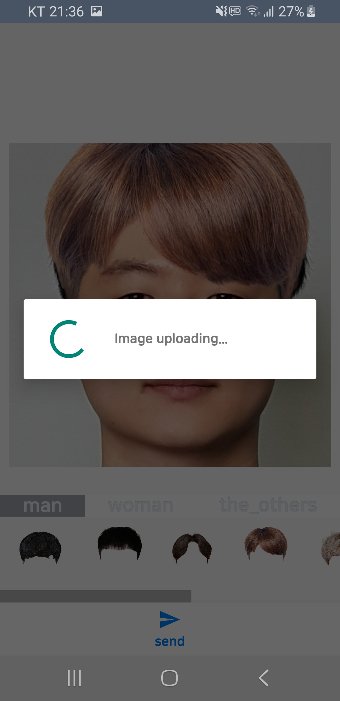 

 

아래 헤어스타일 목록 중 하나를 골라 드래그앤 드랍하고, 확대/축소를 통해 정성껏 사진을 꾸민다.

 

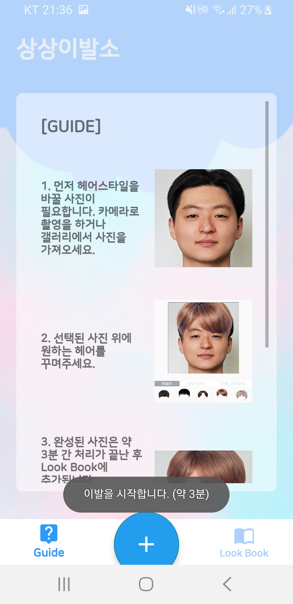  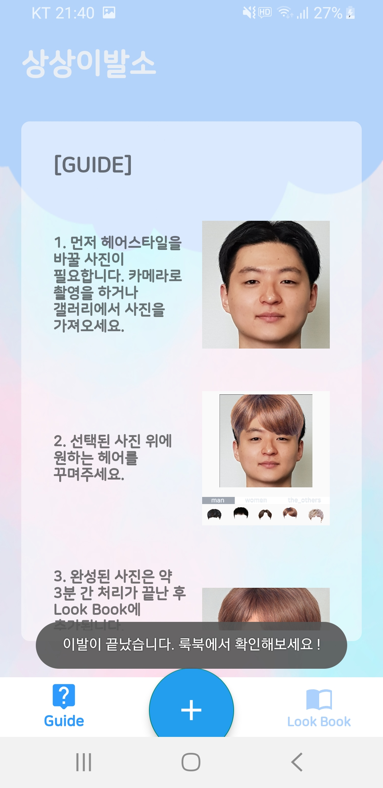  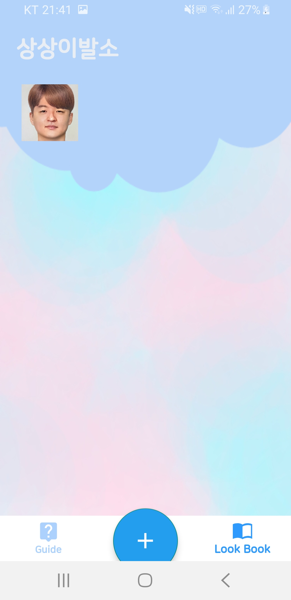 

 

인공지능 처리를 위해 서버로 전송하고 약 3분의 시간이 소요된다. 이 작업들은 백그라운드에서 진행되며, 작업이 완료되면 Toast 알림이 뜨고 결과를 룩북에서 확인할 수 있다.

 

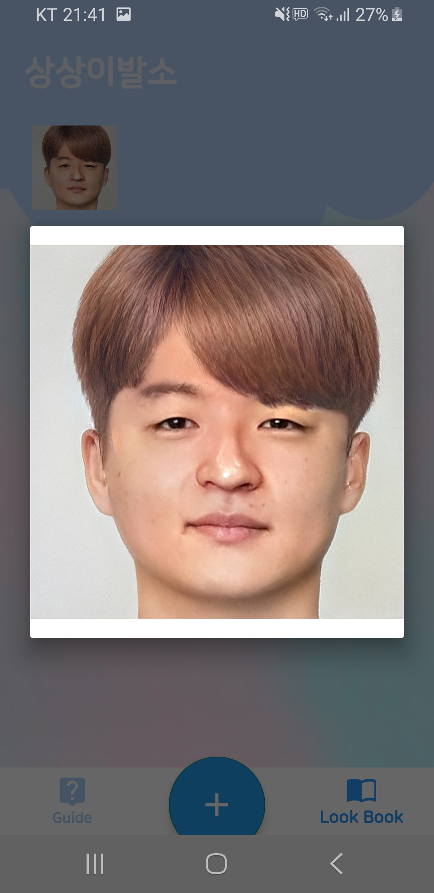 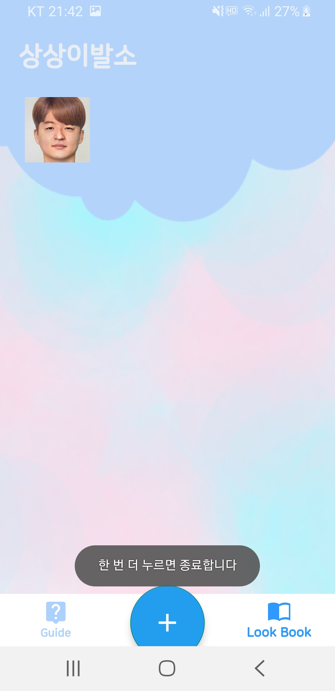 

 

터치하면 크게 확인 가능하고, '뒤로'버튼 2번 입력 시 종료한다.

 
