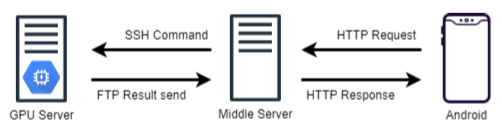

# 상상이발소 미들 서버
상상이발소 안드로이드 앱과 통신하는 서버이며 GPU 서버와의 중간자 역할을 하기도 한다.

## Structure

미들 서버는 클라이언트(안드로이드)의 요청을 받아 결과를 전송하는 역할을 하며, GPU 서버는 StyleGAN 이미지 처리를 실행한다. 
StyleGAN은 좋은 성능을 요구하기 때문에 다른 고성능 GPU 서버에서 실행시켰으며, FaceSwap은 미들 서버에서 실행시켜서 결과를 만들었다.

## FaceSwap
StyleGAN을 활용하여 스타일은 잘 추출하지만 얼굴의 어색함이 존재하여 실제 사용자의 얼굴로 바꿔주는 작업이 필요하다.

## References
- https://github.com/wuhuikai/FaceSwap
